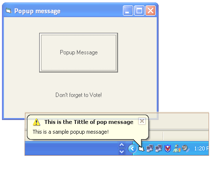



## Popup Balloon

### Description

Sends the program to the system tray and when you click on the command button it will show a popup balloon. - (See Screenshot) No OCX Files needed!
 
### More Info
 

             |
---                |---
**Submitted On**   |2004-10-30 00:44:02
**By**             |
**Level**          |Intermediate
**User Rating**    |4.5 (50 globes from 11 users)
**Compatibility**  |VB 6\.0
**Category**       |[Coding Standards](https://github.com/Planet-Source-Code/PSCIndex/blob/master/ByCategory/coding-standards__1-43.md)
**World**          |[Visual Basic](https://github.com/Planet-Source-Code/PSCIndex/blob/master/ByWorld/visual-basic.md)
**Archive File**   |[Popup\_Ball18119210292004\.zip](https://github.com/Planet-Source-Code/popup-balloon__1-56992/archive/master.zip)

